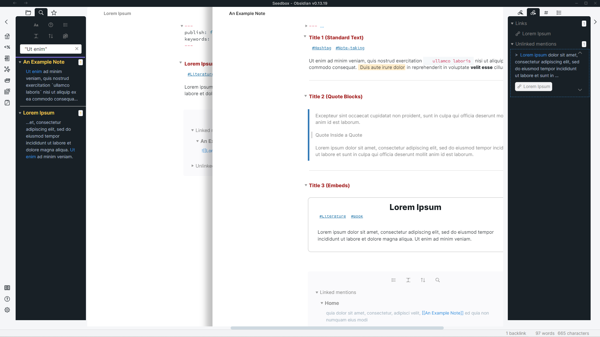
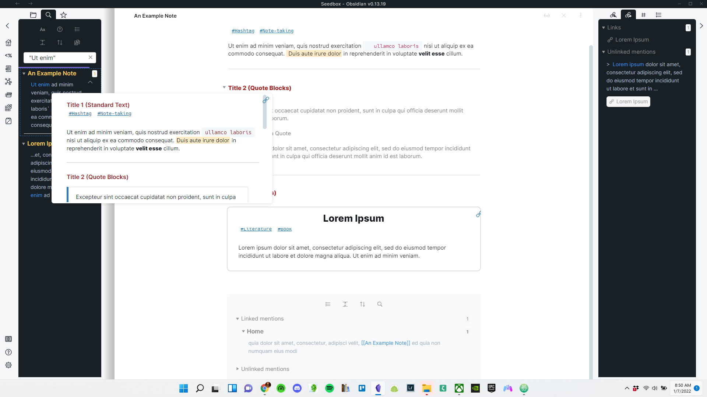
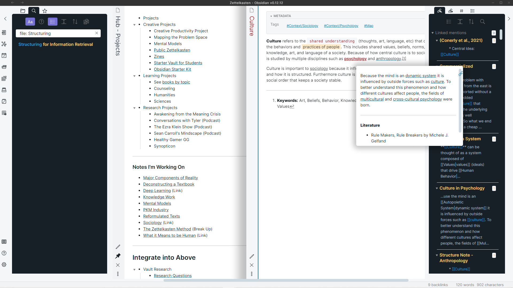
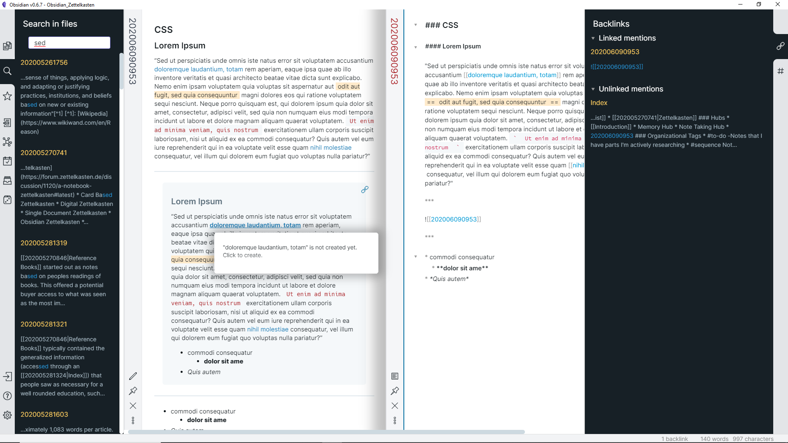
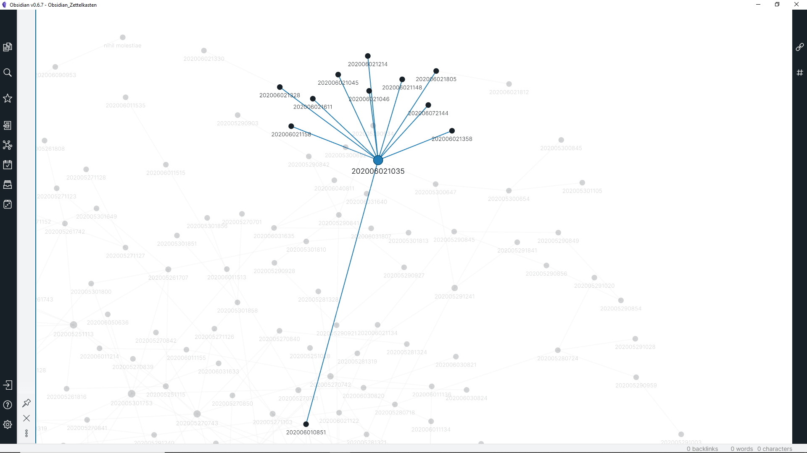
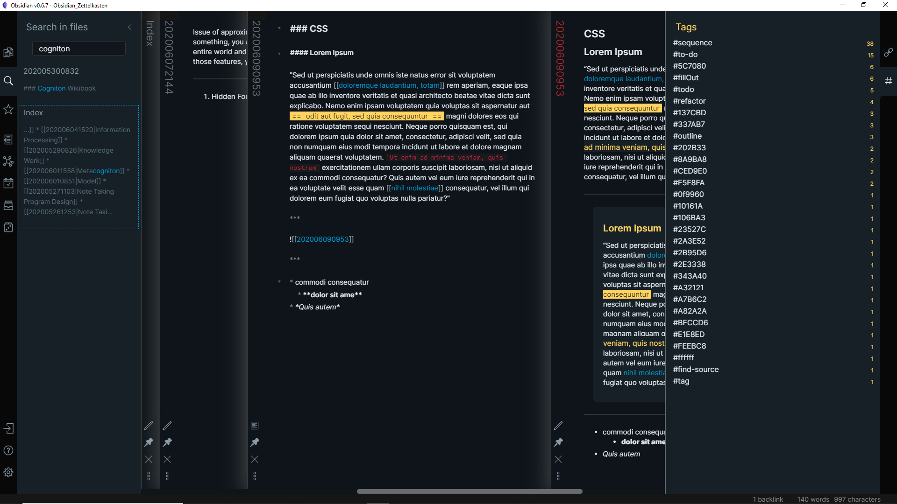
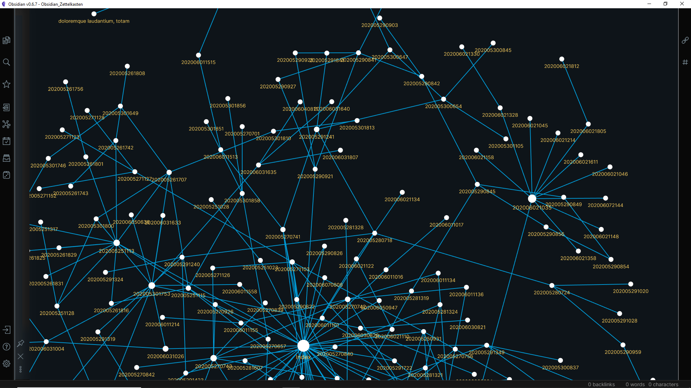

## Note to Visitors (01/07/2022)

Howdy! I've been using this theme for the past month. In doing so, I've been tweaking it to work slightly different and with the Andy Mode plugin instead of CSS code. 
* obsidian.css - the current active theme that I'm using and updating
* obsidianAlt.css - a theme from august of last year that has muted links for easier readability
* obsidianOriginal.css - the theme that was previously here, in case anyone prefers this

For further discussion, see [the post on Obsidian forum](https://forum.obsidian.md/t/theme-lizardmen-zettelkasten-light-dark/1519).

***

# Lizardmen Zettelkasen for [Obsidian.md](https://obsidian.md/)
An [Obsidian](https://obsidian.md/) CSS light Theme geared towards Zettelkasten (compatible with v. 0.12.10)

## New Version of the Theme (Jan 2022)

***

## Muted Version of the Theme

Difference with this one is that the links aren't blue and instead just underlined. In addition to that, hovered internal links are red now, while external hovered links are blue. 

***

## Original Theme Screenshots

***

## Dark Version hasn't been Maintained

## Install

1. Download the obsidian.css file.

2. In Obsidian click Settings -> Plugins and turn on "Custom CSS".

3. Put the "obsidian.css" in your vault root folder.

4. Restart Obsidian.

## Creator

This theme is created and maintained by Nick([Twitter](https://twitter.com/dogwaddle)). If there is a design change you'd like to see to this theme, let me know and I will consider it. Always open to suggestions.
